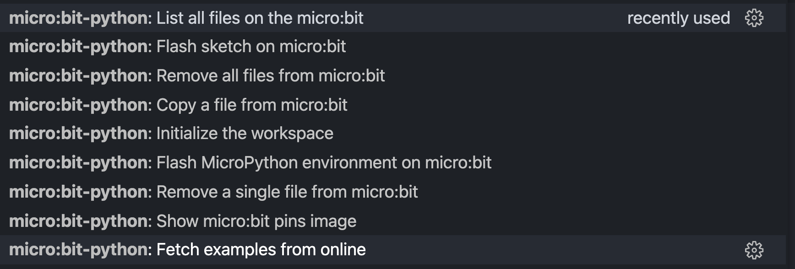
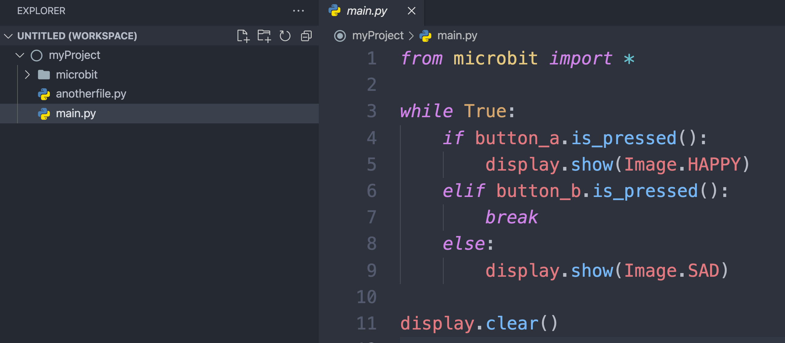
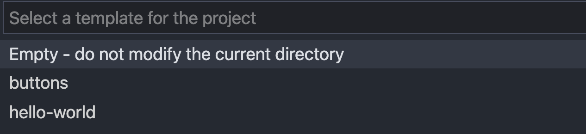

# VScode micro:bit-MicroPython Extension

This extension provides a self-contained developing environment for developing with _MicroPython_ using the _micro:bit_ platform.

It allows to initialize a project with an optional template example, to upload a python _sketch_ (terminology borrowed from [Processing](<https://en.wikipedia.org/wiki/Processing_(programming_language)>)) on the micro:bit, or to remove/get files from the micro:bit file system.

To see the commands for the extension, use the command palette (**Windows / Linux**: `CTRL + Shitf + P`, **Mac**: `⌘ + Shift + P`) and search for `micro:bit-python`. You will see the following list.

Each feature is explained in the sections below.

---

## Getting started

For a video tutorial of how to use this extension, please refer to [this link](https://youtu.be/eSGJLu1kqyg).

1. [Download an install](https://www.python.org/downloads/) python on your system preferably python3.
2. Open VSCode and install the [micro:bit python extension](https://marketplace.visualstudio.com/items?itemName=MAKinteract.micro-bit-python)
3. Connect the micro:bit via USB cable (make sure your cable allows for data transfer and it is not only a charging cable)
4. The first time, run the command `micro:bit-python: Flash MicroPython environment on micro:bit`
5. Open an empty workspace (aka folder) in VSCode and run the command `micro:bit-python: Initialize the workspace`. To start, choose the **hello-world** sample code.
6. Upload your files to the micro:bit using the command `micro:bit-python: Flash sketch on micro:bit`.

---

## Features in details

### `Flash MicroPython environment on micro:bit`

Use this command the first time you use MicroPython. It will erase the micro:bit and install the MicroPython interpreter.

Under the hood, this command uses [uflash](https://github.com/ntoll/uflash) to flash the MicroPython firmware.

### `Flash sketch on micro:bit`

This command copies all the files from the current workspace on the micro:bit. For the command to work, there **must exist** a `main.py` file (the starting point of your program). Furthermore, _folders and files nested in folders will be ignored_ - only files at the root of the workspace will be copied. You can also use the shortcut `CTRL + F5` (Windows / Linux) or `⌘ + F5` (Mac).

For example, in the image below, `main.py` and `anotherfile.py` will be flashed onto the micro:bit, while the folder microbit and all its content will be ignored.

Under the hood, flashing is achieved using the [microfs](https://github.com/ntoll/microfs) script.

### `Initialize the workspace`

This command initializes the current workspace by copying a _microbit_ folder in the workspace (used to enable VScode IntelliSense), and by prompting the user to select a template file.

For example, if the user were to pick `buttons` or `hello-world` from the list above, the files of these projects would be copied in the current workspace, overriding existing files.

The user can also select `Empty` - in such case, no changes to files occur.

The templates are fetched from this [online repository](https://github.com/makinteract/micropython-examples). The _microbit_ folder is fetched from [this respository](https://github.com/PhonicCanine/microbit).

### `Fetch examples from online`

This command manually fetches the latest example snippets from this [online repository](https://github.com/makinteract/micropython-examples). In order for this command to work, you must be connected to the Internet.

### `Copy a file from micro:bit`

This command shows the files stored on the micro:bit file system and prompts the user to pick one to be copied on the user's workspace.

Under the hood, this command uses `ufs get`.

### `Remove all files from micro:bit`

This command removes all the files on the micro:bit files system (it will not remove the MicroPython interpreter though).

Under the hood, the command uses the `ufs rm` command.

### `Remove a single file from micro:bit`

This command prompts the user to choose a file to remove from the micro:bit file system.

Under the hood, the command uses the `ufs rm` command.

---

## Requirments

The only requirment is to have Python installed and in the _PATH_ variable. Other dependencies ([microfs](https://github.com/ntoll/microfs) and [uflash](https://github.com/ntoll/uflash)) are taken care of automatically.

This extension also draws some inspiration from [another micro:bit python extension](https://github.com/PhonicCanine/vscode-microbit), which you might want to consider as an alternative.

---

## For developers

If you want to modify this extension, fork then clone this repository on your machine. Run `npm install`, to install dependencies (need to have Node.js installed). From any javascript file, press `F5` to run the extension locally in debug mode.

---

## Known Issues

Refer to the [issues page](https://github.com/makinteract/vscode-microbit-micropython/issues). Please file any issues there.

---

## Releases Notes

**0.1.0**

Initial release

---

## License

MIT
